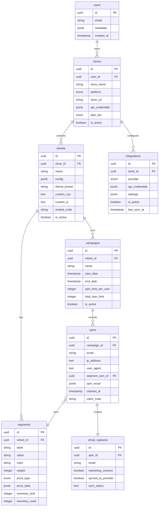

# SpinWheel Pro - Architecture & Implementation Guide

## 📋 Table of Contents

1. [Overview](#overview)
2. [Technology Stack](#technology-stack)
3. [Project Structure](#project-structure)
4. [Database Architecture](#database-architecture)
5. [Authentication System](#authentication-system)
6. [Core Features](#core-features)
7. [API Services](#api-services)
8. [Frontend Architecture](#frontend-architecture)
9. [Security & Permissions](#security--permissions)
10. [Deployment Guide](#deployment-guide)
11. [Development Workflow](#development-workflow)

## Overview

SpinWheel Pro is a production-ready SaaS application that allows e-commerce stores to create and manage promotional spin wheels. It's designed to be platform-agnostic, supporting Shopify, Tienda Nube, and custom implementations.

### Key Features

- 🏪 Multi-tenant architecture with store isolation
- 🎨 Customizable wheel designs and themes
- 📊 Advanced analytics and conversion tracking
- 📧 Email capture with marketing integrations
- 🎯 Weighted probability system for prizes
- 📱 Mobile-responsive embeddable widget
- 🔒 Enterprise-grade security with RLS

## Technology Stack

### Frontend

- **React 19** - Latest React with concurrent features
- **TypeScript** - Type safety throughout the application
- **Vite** - Lightning-fast build tool and dev server
- **Tailwind CSS** - Utility-first CSS framework
- **Radix UI** - Unstyled, accessible component primitives
- **Framer Motion** - Production-ready animation library
- **React Router v7** - Client-side routing
- **React Query (TanStack Query)** - Server state management
- **Zustand** - Lightweight client state management
- **Recharts** - Composable charting library
- **Zod** - Schema validation

### Backend

- **Supabase** - Backend-as-a-Service
  - PostgreSQL database
  - Authentication
  - Row Level Security (RLS)
  - Edge Functions
  - Realtime subscriptions
- **TypeScript** - Shared types between frontend and backend

## Project Structure

```
spin_the_wheel/
├── src/
│   ├── components/          # Reusable UI components
│   │   ├── ui/             # Base UI components (button, input, etc.)
│   │   ├── wheel/          # Wheel-specific components
│   │   └── dashboard/      # Dashboard-specific components
│   ├── contexts/           # React contexts (Auth, etc.)
│   ├── hooks/              # Custom React hooks
│   ├── lib/                # Library configurations
│   ├── pages/              # Route pages
│   │   ├── auth/          # Authentication pages
│   │   └── dashboard/     # Dashboard pages
│   ├── services/           # API service layer
│   ├── types/              # TypeScript type definitions
│   ├── utils/              # Utility functions
│   └── Router.tsx          # Application routing
├── supabase/
│   └── migrations/         # Database migrations
├── public/                 # Static assets
└── dist/                   # Build output
```

## Database Architecture

### Entity Relationship Diagram



### Key Database Features

1. **Row Level Security (RLS)**

   - Users can only access their own stores
   - Automatic data isolation between tenants
   - Public access for widget spin recording

2. **Triggers & Functions**

   - Auto-update `updated_at` timestamps
   - Generate embed codes automatically
   - Validate inventory limits

3. **Indexes**
   - Performance optimization for common queries
   - Email lookups for duplicate prevention
   - Campaign date range queries

## Authentication System

### Components

1. **AuthContext** (`src/contexts/AuthContext.tsx`)

   - Manages authentication state
   - Provides auth methods (signIn, signUp, signOut)
   - Handles session persistence

2. **Protected Routes** (`src/components/ProtectedRoute.tsx`)

   - Wraps dashboard routes
   - Redirects to login if not authenticated
   - Shows loading state during auth check

3. **Auth Pages**
   - Login page with email/password
   - Signup with password confirmation
   - Password reset functionality

### Flow

```
User → Login Page → Supabase Auth → Session Token → Protected Dashboard
                ↓
            AuthContext
                ↓
         Store user state
```

## Core Features

### 1. Multi-Tenant Store Management

- **Store Creation**: Connect multiple e-commerce platforms
- **Platform Support**: Shopify, Tienda Nube, custom websites
- **Plan Tiers**: Free, Starter, Growth, Enterprise
- **API Credentials**: Encrypted storage for platform APIs

### 2. Wheel Configuration System

```typescript
interface WheelConfiguration {
  segments: SegmentConfig[]; // Prize segments
  spinDuration: number; // Animation duration
  spinRevolutions: number; // Full rotations
  friction: number; // Deceleration factor
  easeType: string; // Animation easing
  appearance: {
    showConfetti: boolean;
    soundEnabled: boolean;
    pointerStyle: "arrow" | "triangle" | "star";
    wheelSize: number;
    fontSize: number;
    borderWidth: number;
    borderColor: string;
  };
  messages: {
    // Customizable text for all UI elements
  };
}
```

### 3. Weighted Probability System

```typescript
// Calculate winning segment based on weights
const selectWinningSegment = (segments: Segment[]) => {
  const totalWeight = segments.reduce((sum, s) => sum + s.weight, 0);
  let random = Math.random() * totalWeight;

  for (const segment of segments) {
    random -= segment.weight;
    if (random <= 0) return segment;
  }
};
```

### 4. Campaign Management

- **Time-based Campaigns**: Set start/end dates
- **Spin Limits**: Per-user and total campaign limits
- **Active/Inactive States**: Enable/disable without deletion
- **Analytics Tracking**: Conversion rates, participation

### 5. Email Integration System

```typescript
interface Integration {
  provider: "mailchimp" | "klaviyo" | "sendgrid" | "activecampaign";
  apiCredentials: {
    apiKey: string;
    listId?: string;
    // Provider-specific fields
  };
  settings: {
    autoSync: boolean;
    syncInterval: number;
    customFields: Record<string, string>;
  };
}
```

## API Services

### Service Architecture

Each service follows a consistent pattern:

```typescript
class ServiceName {
  static async create(data: Input): Promise<ApiResponse<Model>> {
    try {
      // Supabase operation
      return { data: result, success: true };
    } catch (error) {
      return { error: error.message, success: false };
    }
  }
}
```

### Available Services

1. **StoreService** (`src/services/storeService.ts`)

   - CRUD operations for stores
   - Store statistics aggregation
   - Plan tier management

2. **WheelService** (`src/services/wheelService.ts`)

   - Wheel creation and configuration
   - Segment management
   - Wheel duplication

3. **CampaignService** (`src/services/campaignService.ts`)

   - Campaign lifecycle management
   - Spin recording and validation
   - Analytics data aggregation

4. **IntegrationService** (`src/services/integrationService.ts`)
   - Email provider connections
   - Batch email synchronization
   - Provider-specific templates

## Frontend Architecture

### Component Hierarchy

```
App
├── Router
│   ├── Public Routes
│   │   ├── Demo (Original wheel demo)
│   │   ├── Login
│   │   └── Signup
│   └── Protected Routes (Dashboard)
│       ├── Stores
│       ├── Wheels
│       ├── Campaigns
│       ├── Analytics
│       ├── Integrations
│       └── Settings
```

### State Management

1. **Server State** (React Query)

   - API data caching
   - Optimistic updates
   - Background refetching

2. **Client State** (Zustand)

   - UI state (modals, sidebars)
   - User preferences
   - Temporary form data

3. **Auth State** (Context API)
   - User session
   - Authentication status
   - Permission levels

### UI Component Library

Built on Radix UI primitives with Tailwind styling:

- **Button**: Multiple variants (primary, secondary, ghost, destructive)
- **Dialog**: Modal dialogs with portal rendering
- **Form Controls**: Input, Select, Switch, Slider
- **Card**: Content containers with consistent styling
- **Tabs**: Navigation between related content

## Security & Permissions

### Row Level Security (RLS) Policies

```sql
-- Users can only see their own stores
CREATE POLICY "Users can view their own stores" ON stores
    FOR SELECT USING (auth.uid() = user_id);

-- Cascade permissions through relationships
CREATE POLICY "Users can view wheels from their stores" ON wheels
    FOR SELECT USING (
        EXISTS (
            SELECT 1 FROM stores
            WHERE stores.id = wheels.store_id
            AND stores.user_id = auth.uid()
        )
    );
```

### API Security

1. **Encrypted Credentials**: API keys stored encrypted
2. **HTTPS Only**: All communication over TLS
3. **CORS Configuration**: Whitelist allowed origins
4. **Rate Limiting**: Prevent abuse (configured in Supabase)

### Data Privacy

- **GDPR Compliance**: Right to deletion, data export
- **Marketing Consent**: Explicit opt-in for emails
- **Data Retention**: Configurable retention policies
- **Audit Logging**: Track sensitive operations

## Deployment Guide

### Prerequisites

1. **Supabase Project**

   ```bash
   # Create project at supabase.com
   # Get URL and anon key from project settings
   ```

2. **Environment Variables**

   ```bash
   cp .env.example .env
   # Fill in your Supabase credentials
   ```

3. **Database Migration**
   ```sql
   -- Run in Supabase SQL editor
   -- Copy contents of supabase/migrations/001_initial_schema.sql
   ```

### Production Build

```bash
# Install dependencies
npm install

# Run tests
npm test

# Build for production
npm run build

# Preview production build
npm run preview
```

### Deployment Options

1. **Vercel** (Recommended)

   ```bash
   npm i -g vercel
   vercel
   ```

2. **Netlify**

   - Connect GitHub repo
   - Build command: `npm run build`
   - Publish directory: `dist`

3. **Self-hosted**
   - Serve `dist` folder with nginx/apache
   - Configure SSL certificates
   - Set up reverse proxy for API

### Widget Deployment

```javascript
// Embed code for merchants
<script
  src="https://yourdomain.com/widget.js"
  data-wheel-id="UUID_HERE"
  data-trigger="exit_intent"
></script>
```

## Development Workflow

### Local Development

```bash
# Start dev server
npm run dev

# Run type checking
npm run type-check

# Run linting
npm run lint

# Run tests
npm test
```

### Git Workflow

```bash
# Feature branch
git checkout -b feature/wheel-analytics

# Make changes and commit
git add .
git commit -m "feat: add conversion funnel to analytics"

# Push and create PR
git push origin feature/wheel-analytics
```

### Code Style Guidelines

1. **TypeScript First**: Always define types
2. **Functional Components**: Use hooks over classes
3. **Composition**: Small, focused components
4. **Error Handling**: Always handle errors gracefully
5. **Performance**: Lazy load heavy components

### Testing Strategy

```typescript
// Component testing
describe("WheelBuilder", () => {
  it("should create wheel with segments", async () => {
    // Test implementation
  });
});

// Service testing
describe("CampaignService", () => {
  it("should enforce spin limits", async () => {
    // Test implementation
  });
});
```

## Future Enhancements

1. **A/B Testing**: Test different wheel configurations
2. **AI Optimization**: ML-based prize distribution
3. **Webhooks**: Real-time event notifications
4. **Mobile App**: Native iOS/Android management
5. **White Label**: Full branding customization
6. **Analytics API**: Export data to BI tools

---

## Support & Documentation

- **Documentation**: `/docs` folder (coming soon)
- **API Reference**: Swagger/OpenAPI spec
- **Support**: support@spinwheelpro.com
- **Community**: Discord server

## License

Copyright © 2025 SpinWheel Pro. All rights reserved.
